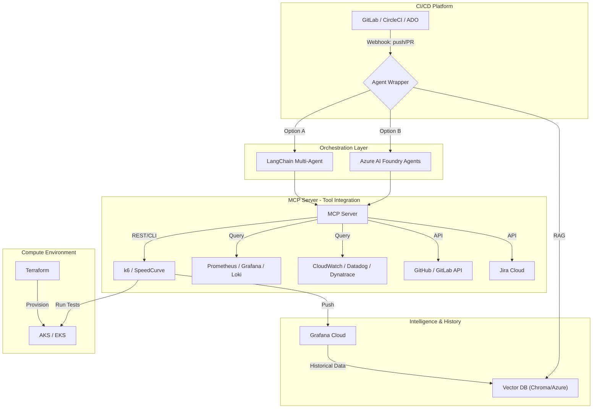
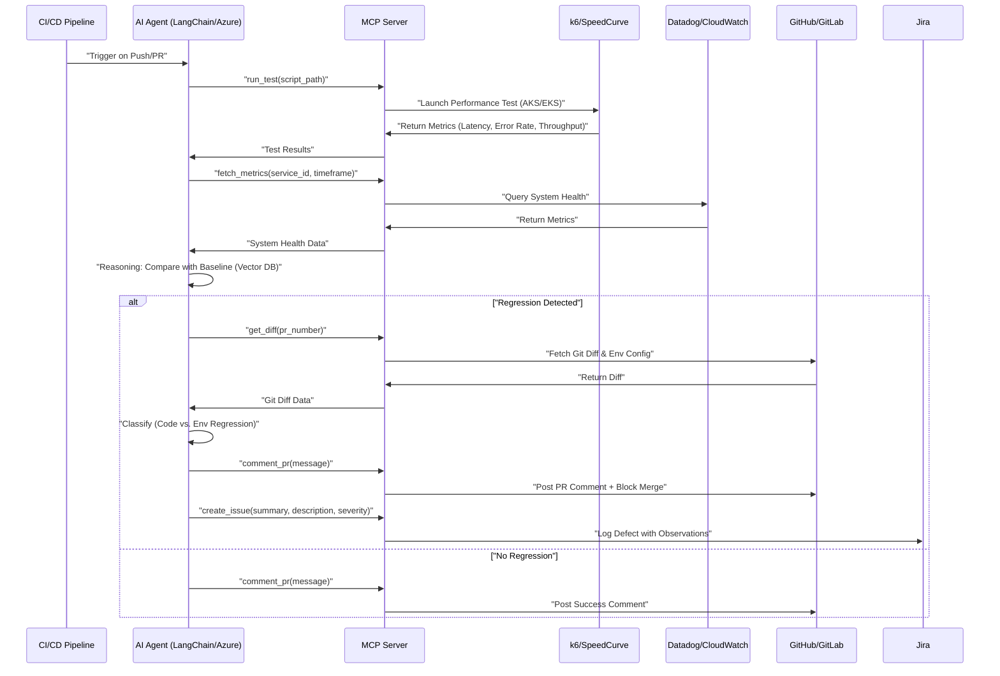
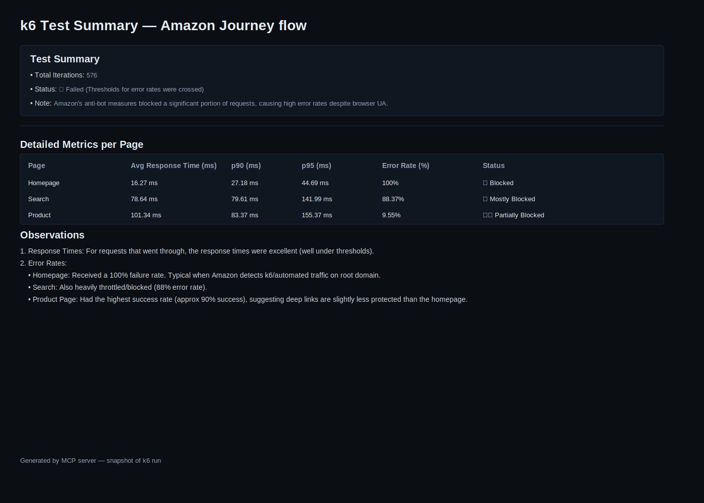

# High-Level Design (HLD): AI_PerfAgent v1.0

## 1. Executive Summary
AI_PerfAgent v1.0 is an autonomous performance engineering agent designed to integrate into CI/CD pipelines (GitLab, CircleCI, ADO). It orchestrates performance tests, analyzes results using LLMs/Agents, and provides automated RCA (Root Cause Analysis) and resolution via PR comments and Jira logging.

---

## 2. System Architecture

---

## 3. Workflow & Flow Diagram

### 3.1 Performance Regression Loop

---

## 4. Component Details

### 4.1 Orchestration Layer
- **LangChain Agents**: Utilizes OpenSpec-compliant tools. Best for local Llama 3.1 integration and custom logic hooks.
- **Azure AI Foundry**: Provides enterprise-grade scaling and deep integration with Azure Monitoring tools.

### 4.2 MCP Server (Model Context Protocol)
The MCP server acts as the central router for the agents to interact with the external world:
- **k6 Tool**: `run_test(script_path)`, `get_summary(run_id)`.
- **Monitoring Tool**: `fetch_metrics(service_id, timeframe)`.
- **Git Tool**: `get_diff(pr_number)`, `comment_pr(message)`.
- **Jira Tool**: `create_issue(summary, description, severity)`.

### 4.3 Reasoning & Analysis
- **Contextual Prompts**: The LLM is provided with current metrics + historical baselines retrieved from the Vector DB.
- **Self-Healing**: If a code regression is found (e.g., inefficient SQL), the LLM suggests specific code fixes in the PR comment.

### 4.4 Reporting
- **summary.jpg**: A generated reporting image (JPG) that visually aggregates test run results, regression summaries, links to Grafana dashboards, related PR diffs, and Jira tickets. The MCP server produces this image by fetching aggregated metrics and metadata, rendering a stakeholder-friendly snapshot, and exposing download/embed links. A companion CSV/JSON export endpoint is available for archival and automation.

Embedded preview:

### 4.5 Resolution & Self-Healing (Requirement 7 & 8)
- **Automated PR Comments**: If regression is detected, the agent uses the GitHub/GitLab API to post a detailed comment containing:
    - Regression metrics (e.g., "Latency increased by 25ms").
    - Correlated Git Diff (e.g., "Change in `db_query.py:L45` suspected").
    - Suggested code fix or configuration adjustment.
- **CI Status**: The agent can optionally set the CI status to `fail` (Blocking Merge) if the regression exceeds a predefined threshold (e.g., >10% overhead).
- **Jira Integration**: For tracking, the agent creates a "Perf Defect" in Jira via the MCP server, linking the PR and the Grafana result URL.

---

## 5. Prerequisites & Technical Specifications

### 5.1 API Keys & Access
- **LLM**:
    - Azure OpenAI Endpoint + API Key (for high-level reasoning).
    - Local Llama 3.1 8b setup (via Ollama or similar) on RTX 4070.
- **Monitoring**: Datadog/Dynatrace/CloudWatch API keys with read access to metrics and logs.
- **VCS**: Personal Access Token (PAT) for GitHub/GitLab with `repo` and `pull_requests` scope.
- **Performance**: k6 Cloud token or SpeedCurve API key.
- **Jira**: Jira Cloud API Token and Site URL.

### 5.2 Infrastructure
- **Terraform**: To manage AKS/EKS cluster lifecycle.
- **Helm**: To deploy the k6 runner pods into the clusters.

---

## 6. Implementation Notes for Production
- **Security**: Use OIDC for pipeline-to-cloud authentication. Ensure LLM prompts avoid leaking sensitive secrets.
- **Reliability**: Implement retry logic in MCP server for fluctuating monitoring APIs.
- **Scalability**: Agent should handle multiple PRs concurrently using a queue-based system if needed.
- **OpenSpec**: Adhere to OpenSpec for tool definitions in LangChain to ensure portability across different LLM providers.

---

## 7. Delivery & Review Plan
- **Daily Sync**: 15-minute check-in to align on regression classification logic.
- **Code Walkthrough**: A recorded video with voice-over will be provided once the initial prototype is functional, explaining the MCP server structure and Agent reasoning loop.
