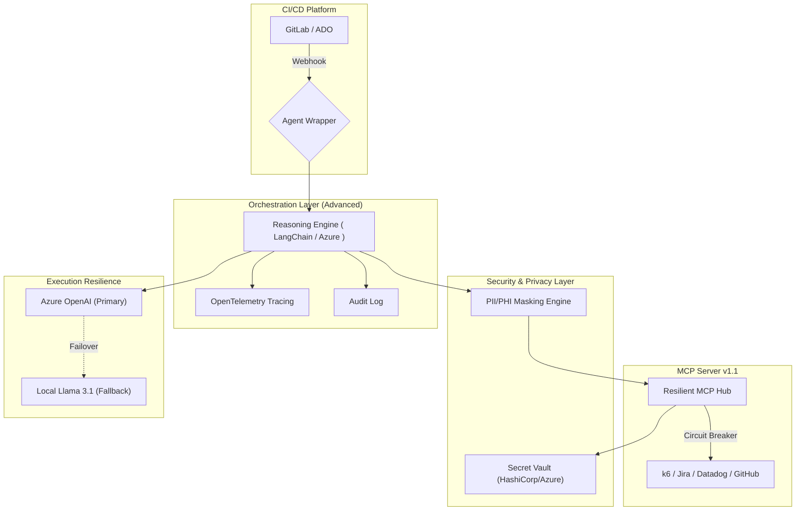
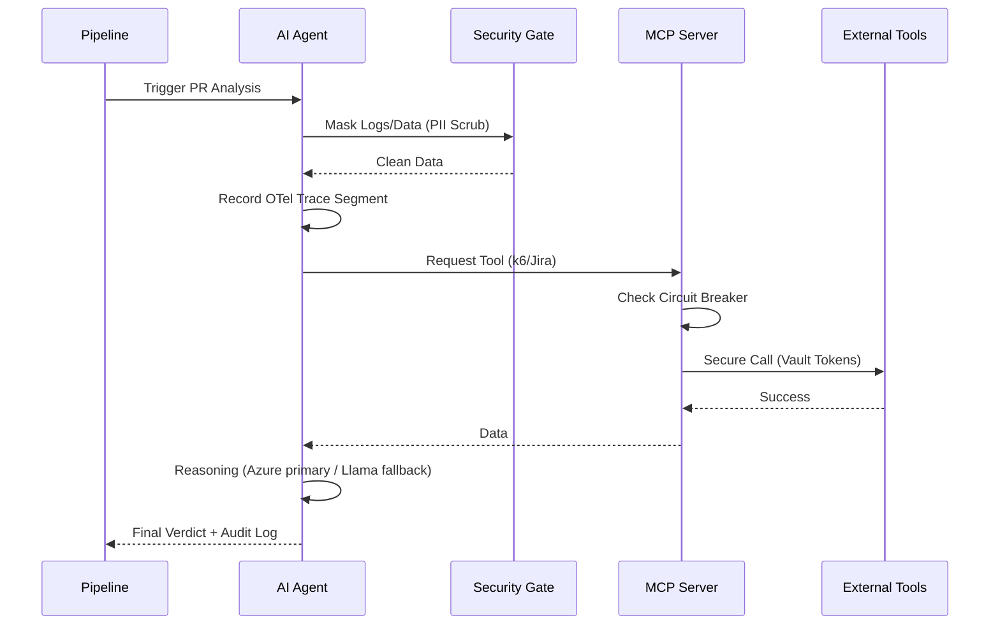
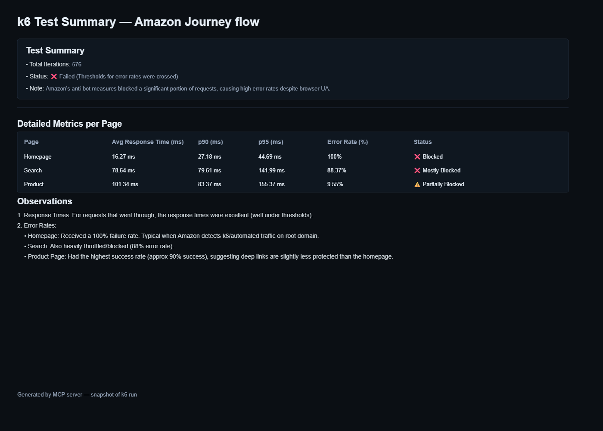

# High-Level Design (HLD): AI_PerfAgent v1.1 - Enterprise Edition

## 1. Introduction
Building upon v1.0, AI_PerfAgent v1.1 introduces advanced enterprise capabilities focused on **Governance, Security, Observability, and Resilience**. It is designed for large-scale deployments where auditing, cost-control, and reliability are critical.

---

## 2. Advanced System Architecture

---

## 3. New Enterprise Features

### 3.1 Observability & AI Explainability
- **OTel Tracing**: Every performance analysis "run" is traced via OpenTelemetry. Stakeholders can see the exact steps: *Fetch Metrics -> RAG Query -> LLM Reasoning -> Decision*.
- **Confidence Scoring**: The agent provides a confidence percentage (e.g., "85% Confidence this is a Code Regression") based on the strength of correlations found in logs.

### 3.2 Security & Compliance
- **PII Scrubbing**: Before metrics or logs are sent to the LLM (Cloud or Local), the Masking Engine identifies and scrubs sensitive data (emails, IPs, tokens).
- **Audit Trails**: Non-repudiable logs of all Agent actions, including which code was analyzed and which Jira tickets were modified.

### 3.3 Advanced Resilience (Fail-Safe Ops)
- **Tool Circuit Breakers**: If Datadog or k6 returns a 5xx error, the MCP server trips a circuit breaker to prevent the agent from making further calls, saving cost and preventing "log spam".
- **Infinite Loop Protection**: Logic to detect "rebase-cycles" or "test-loops" to ensure the agent doesn't consume excessive tokens on the same PR state.

### 3.4 Governance & HITL (Human-in-the-Loop)
- **Policy-as-Code**: Define performance thresholds in a YAML-based policy file. The agent enforces these policies consistently across all services.
- **Interactive Checkpoints**: For high-risk changes, the agent pauses and waits for a Slack-based approval before final resolution.

---

## 4. Enhanced Workflow (v1.1)

---

## 5. Implementation Roadmap (v1.1)

| Feature | Priority | Implementation Strategy |
| :--- | :--- | :--- |
| **Failover Logic** | High | Implement Azure-to-Local Llama switching in the Orchestrator. |
| **PII Masking** | High | Regex-based scrubbing in the pipeline middle-layer. |
| **OTel Tracing** | Med | Integrate `OpenTelemetry` SDK into the LangChain wrapper. |
| **Audit Log** | Med | Write structured JSON logs to a secure S3/Blob storage bucket. |

---

## 6. Documented Prerequisites (v1.1 Updates)
- **Infrastructure**: HashiCorp Vault or Cloud Secret Manager setup.
- **Monitoring**: OpenTelemetry collector endpoint (e.g., Jaeger or Honeycomb).
- **LLM**: Local Ollama instance running Llama 3.1 8b for fallback and high-volume preliminary analysis.

8. Advanced Monitoring Integration

Log Pattern Analysis: Use LLM to analyze Loki/CloudWatch logs for error patterns
APM Deep Dive: Integrate with New Relic/AppDynamics for code-level insights
Custom Metrics: Allow teams to define domain-specific performance metrics
Real-time Streaming: Monitor live production metrics during deployments

9. Resilience & Reliability

Circuit Breaker Pattern: Prevent cascading failures in MCP server

10. Environment Parity

Environment Comparison: Detect performance differences between staging/production

11.VS Code Extension: Real-time performance hints while coding
Local Performance Testing: Run lightweight perf checks on developer machines
Performance Budget Files: .perfbudget.yml in repos to define acceptable thresholds
Interactive Debugging: Chat interface to query the agent about specific regressions

12. Metrics & Observability for the Agent Itself

Agent Health Dashboard: Monitor LLM response times, MCP server latency, analysis accuracy
Cost Tracking: Monitor LLM API costs, test execution costs
Accuracy Metrics: Track precision/recall of regression detection
SLA Monitoring: Ensure agent provides results within acceptable time windows

13. 
### 4.2 MCP Server (Model Context Protocol)
The MCP server acts as the central router for the agents to interact with the external world:
- **k6 Tool**: `run_test(script_path)`, `get_summary(run_id)`.
- **Monitoring Tool**: `fetch_metrics(service_id, timeframe)`.
- **Git Tool**: `get_diff(pr_number)`, `comment_pr(message)`.
- **Jira Tool**: `create_issue(summary, description, severity)`.
- **Distributed Tracing Integration**: Connect to grafana/dynatrace for transaction-level   
    analysis
- **Database Query Analysis**: Integrate with database slow query logs, AWR report and explain plans 

Memory Profiling: Detect memory leaks, garbage collection issues, connect to jprogiles tool for memory profiling
Network Analysis: Identify network latency, connection pool exhaustion
Correlation Engine: Cross-reference multiple data sources (logs, metrics, traces) to identify cascading failures

Smart Test Selection: Only run relevant perf tests based on code changes (if only frontend changed, skip backend API tests)
Progressive Load Testing: Automatically creates k6 scripts for new changes/ API.
Chaos Engineering Integration: Inject failures during perf tests to validate resilience
Multi-region Testing: Run tests from different geographic locations
Multi-browser Testing: Run tests from different browsers locations
Multi-device Testing: Run tests from different iphone/andriod devices
Browser Performance: Add real user monitoring (RUM) metrics via Lighthouse/WebPageTest

14.  Reasoning & Analysis
- **Contextual Prompts**: The LLM is provided with current metrics + historical baselines retrieved from the Vector DB. 

Dynamic Baseline Selection: Automatically select appropriate baselines based on the first executed test and mark that as baseline for future test.

Baseline Drift Detection: Track gradual performance degradation over time that might be missed in single PR comparisons

Multi-dimensional Baselines: Store baselines for different percentiles (p50, p95, p99), not just averages

Baseline Versioning: Link baselines to specific app versions/commits for better historical comparison

- **Self-Healing**: If a code regression is found (e.g., inefficient SQL), the LLM suggests specific code fixes in the PR comment.

Proactive and reactive agent : The agent is reactive (detects regressions after they occur).
However , The agent can be proactive (detects regressions before they occur).

Analyze code changes before running tests to predict performance impact

Trend Analysis: Predict when metrics will exceed thresholds based on historical trends
, for example memory and cpu increase.

Capacity Forecasting: Estimate when current performance trends will hit infrastructure limits

15. Reporting
- A generated reporting that visually aggregates test run results, regression summaries, links to Grafana dashboards, related PR diffs, and Jira tickets. The MCP server produces this image by fetching aggregated metrics and metadata, rendering a stakeholder-friendly snapshot, and exposing download/embed links. A companion CSV/JSON export endpoint is available for archival and automation.

Embedded preview:

Executive Dashboard: High-level KPIs and trends for leadership
Developer Actionable Reports: Specific code snippets with line-level recommendations
Slack/Teams Integration: Real-time notifications with interactive buttons to approve/dismiss findings
Performance SLA Tracking: Monitor compliance with defined performance budgets
Regression Severity Classification: Auto-categorize as Critical/High/Medium/Low based on user impact

16. Advanced Monitoring Integration

Log Pattern Analysis: Use LLM to analyze Loki/CloudWatch logs for error patterns
APM Deep Dive: Integrate with New Relic/AppDynamics for code-level insights
Custom Metrics: Allow teams to define domain-specific performance metrics
Real-time Streaming: Monitor live production metrics during deployments

17. Resilience & Reliability

Circuit Breaker Pattern: Prevent cascading failures in MCP server

18. Environment Parity

Environment Comparison: Detect performance differences between staging/production

19.VS Code Extension: Real-time performance hints while coding
Local Performance Testing: Run lightweight perf checks on developer machines
Performance Budget Files: .perfbudget.yml in repos to define acceptable thresholds
Interactive Debugging: Chat interface to query the agent about specific regressions

20. Metrics & Observability for the Agent Itself

Agent Health Dashboard: Monitor LLM response times, MCP server latency, analysis accuracy
Cost Tracking: Monitor LLM API costs, test execution costs
Accuracy Metrics: Track precision/recall of regression detection
SLA Monitoring: Ensure agent provides results within acceptable time windows
